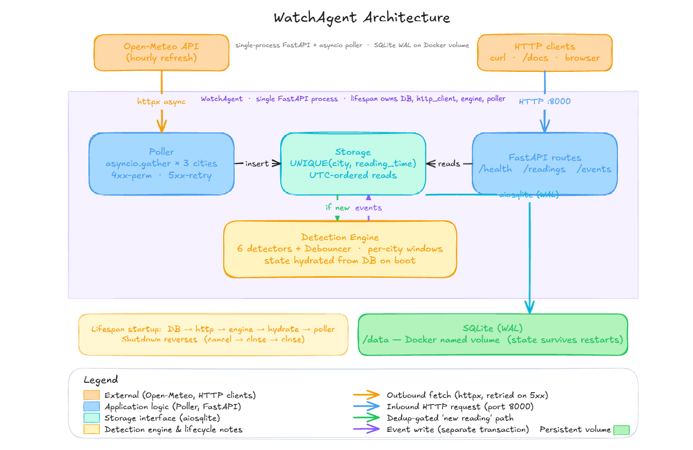

# Design Decisions

This document records the load-bearing architectural decisions in WatchAgent, the failure modes each one prevents, and the tests that pin the resulting invariants. It complements the README's overview and event-detection sections by going deeper into the *why* behind each choice.

The system is deliberately a single FastAPI process: one event loop, one shared `aiosqlite` connection, one shared `httpx.AsyncClient`, and an `asyncio` background task for polling. The alternative considered was a multi-service design with Postgres and a separate poller container. For the time budget, the highest-impact failure mode is the clean-clone disqualifier, and a single process has dramatically less surface area to break on a cold `docker compose up`.

---

## 1. Dedup defense in depth

Three independent layers enforce that the same `(city, reading_time)` is never stored twice.

1. `UNIQUE(city, reading_time)` constraint on the `readings` table — the database physically refuses a duplicate.
2. `INSERT ... ON CONFLICT(city, reading_time) DO NOTHING` in `insert_reading` — dedup is explicit in the SQL.
3. `cursor.rowcount > 0` gate in app code — the boolean tells the poller whether the reading was actually new, which is what gates detection.

Removing any single layer leaves the property intact. The integration tests construct a duplicate-payload case and assert that the row count is unchanged and the new-row signal is `False`.

## 2. Transaction separation between reading and event writes

The reading insert commits its own transaction. Detection then runs. Any resulting events insert in a separate transaction. A detector bug — division by zero, an unhandled `KeyError`, an exception inside reason-string construction — cannot roll back the parent reading. Raw observational data outlives derived events: a reading without an event is acceptable, a missing reading is not.

## 3. Disjoint baseline and the std=0 guard

The per-city rolling window adds the current reading *after* all detectors have run on it. The baseline a detector sees never contains the value it is judging. Without this, a z-score detector silently dampens real anomalies because the spike contributes to its own mean and standard deviation.

When the window's standard deviation is zero, the z-score detector skips without firing. This creates an apparent blind spot — a flat baseline plus a real spike will not fire `temperature_anomaly`. The `rapid_temp_change` detector covers exactly that case from the consecutive-reading delta. The two detectors are designed to cover each other's gaps, not to fire redundantly.

The test that proves disjointness seeds 20 priors at 22.0°C plus a current reading of 35.0°C. The window remains flat (std=0), and the z-score detector skips. If the current value were contaminating the baseline, std would no longer be zero. The no-fire assertion proves the disjoint property using a different system invariant as the tripwire.

## 4. Cooldown semantics in both directions

The Debouncer enforces two distinct rules:

- An *observed clear* — the condition genuinely drops below threshold — followed by re-entry fires a new event. It is a genuinely new occurrence.
- A *sustained anomaly* — continuously held — is suppressed until the cooldown elapses.

After a restart, in-memory `in_anomalous` state is `False` for every key. A fresh post-restart reading that holds the condition would otherwise look like a `False → True` transition and fire. The cooldown hydrated from `latest_event` suppresses this conservatively, because after a restart it is impossible to know whether the condition cleared during the downtime. Cooldown-wins is the safe choice that prevents the "events that never stop firing" failure mode the spec calls out.

## 5. State hydration on boot

On every startup, the engine rebuilds two pieces of state from the database:

1. Per-city rolling windows from the most recent `W` readings (newest-first query, reversed to chronological for replay).
2. Cooldown state from the most recent event per `(city, event_type)`.

The integration test that proves cooldown survives restart boots a first app instance, fires an event, shuts down cleanly, boots a *second* app instance pointing at the same database file, and feeds the same condition again. It asserts `events_stored` does not increment. The two-boot test exercises real container-restart semantics rather than a unit-test mock.

## 6. Strict lifespan ordering

The FastAPI lifespan starts resources in a strict order: `DB → http_client → engine → AWAIT hydration → poller`. The `await hydration` step is load-bearing. The poller task is not created until hydration completes; otherwise the first poll cycle runs against empty windows and defeats warm-up.

Shutdown reverses cleanly: poller `task.cancel()` and `await`, then close `http_client`, then close DB. Reverse order matters: closing the DB while the poller is still mid-cycle would error on shutdown and wedge `docker compose down`.

If any startup step raises, the `async with` lifespan block never yields. The app refuses to start rather than serve traffic with empty state. The test proving this asserts that a synthetic failure placed inside the lifespan block never executes the post-yield code — verifying a negative property.

## 7. Single shared httpx client and asymmetric retry policy

One `httpx.AsyncClient` is created by the lifespan and reused across every city and every poll cycle for the app's lifetime. Connection pooling and TLS reuse work; per-request setup cost is eliminated.

Retry policy is asymmetric:

- **4xx is permanent.** A 400 or 404 means the request is malformed or the resource is gone. Retrying burns the cycle and the logs. One log line, skip the city, move on.
- **5xx, timeouts, and network errors are transient.** Exponential backoff at 1s, 2s, 4s up to `MAX_RETRIES`, bounded by `HTTP_TIMEOUT_SECONDS` per request so the poller cannot hang past its next cycle.

`asyncio.gather(*tasks, return_exceptions=True)` results are iterated with `isinstance(result, BaseException)` checks. The flag stops cancellation propagation; it does not handle exceptions for the caller. Per-city exception entries are logged with their city context.

## 8. Timezone discipline

Two timestamp columns per reading.

- `reading_time` — the naive local civil time string returned by Open-Meteo (e.g. `2026-05-28T13:00`). Stored verbatim. Used for the `UNIQUE(city, reading_time)` dedup constraint.
- `reading_time_utc` — computed at parse time via `reading_time_to_utc(local, utc_offset_seconds)`. Always formatted as `isoformat(timespec="seconds")` → `2026-05-28T17:00:00+00:00`.

All ordering and cross-city math uses `reading_time_utc`. Because the UTC format is pinned to one canonical shape, lexical TEXT sort equals chronological sort — SQLite's `ORDER BY reading_time_utc DESC` is correct without conversion.

The cross-timezone test seeds Vancouver 13:00 local (PDT = 20:00 UTC) and Ottawa 13:00 local (EDT = 17:00 UTC). Ordering across cities by local `reading_time` would mis-sort (the strings are equal). Ordering by `reading_time_utc` returns Vancouver first because 20:00 > 17:00. The test confirms the correct column is being used in production code paths.

## 9. API contract fidelity

Every Pydantic response model uses `extra="forbid"`. Every list endpoint uses `Field(ge=1, le=500)` on `limit` with `default=50` — out-of-range returns 422, not 200. The `context` field in `/events` is parsed from its TEXT column into a `dict[str, Any]` before serialization, so consumers receive a JSON object, not a string of JSON.

Tests assert response shape via set equality on top-level keys (`set(response.json().keys()) == {"status", "readings_stored", "events_stored"}`), not subset containment. A renamed or added field fails the test instead of passing silently.

## 10. WAL on a named volume, verified across restart

SQLite runs in WAL mode for safe in-process concurrent reads/writes. The database lives on a Docker named volume (`watchagent-data:/data`), not a bind mount. WAL semantics on bind mounts have OS-specific quirks; named volumes give consistent ownership and locking behavior across `docker compose down`/`up`.

The persistence verification was executed from `C:\temp\watchagent-verify-fresh` on a Windows host — a different mount path from the development directory. The first cold-up showed `new=3, duplicate=0`. After `docker compose down` (without `-v`) and `docker compose up`, the next cycle showed `new=0, duplicate=3` — proving the readings persisted, the dedup chain works against persisted data, and hydration loaded the windows correctly from disk. Running the verification from a different absolute path on a different OS catches bugs that same-directory verification would not surface.

---

## Architectural alternatives considered and rejected

A few designs were considered and rejected for explicit reasons:

- **Postgres with a separate poller container.** Stronger for production scale, but introduces multi-service orchestration whose failure modes (volume permission drift, networking, startup-order races) are more likely to break a clean-clone run than to demonstrate skill within the time budget.
- **Multi-stage Dockerfile.** Would reduce image size, but the current 241 MB single-stage image is well within reasonable bounds and the multi-stage variant introduces a class of dependency-mismatch bugs between build and runtime stages that needs more verification time.
- **A single combined `precipitation` detector.** Combining onset and heavy-precipitation into one detector loses the diagnostic distinction in the event reason field. Two detectors with shared input cost almost nothing and produce clearer event semantics.
- **Cross-city outlier detection.** A useful addition, but requires defining what makes one city's reading anomalous relative to the others (climate-normal differences make naive variance comparisons misleading). Out of scope for the deadline; the six implemented detectors cover the spec's call-outs.
